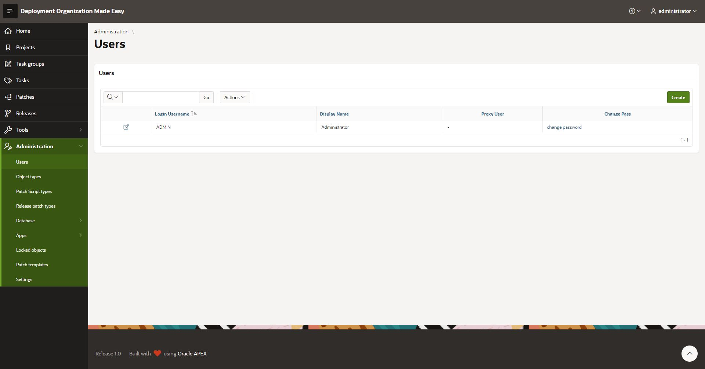
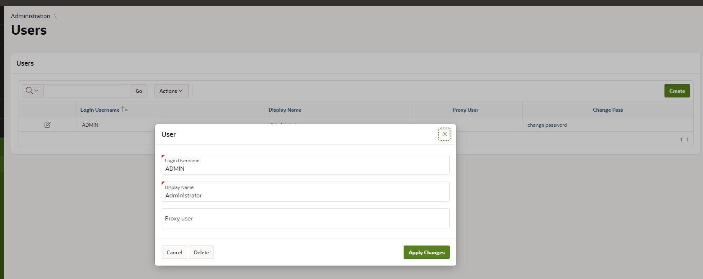

# Maintain Application Users

## Access User Register
Select main menu option Administration -> Users

There You'll have a list of all application users.

To edit user details (application username, display name or proxy DB user name) click on appropriate pen icon.
A modal page opens with option to edit and save changes.

Similar approach is to create a new user.
Click on a Create button in right upper corner and the same modal page as for user details editing opens.

*The meaning of proxy user information is explained in manual regarding recording DDL scripts.*