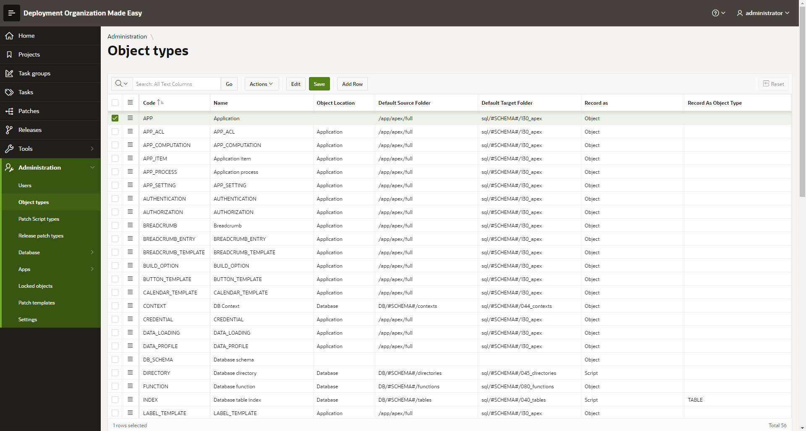

# Maintain Object Types
## Access Object Types Register
Select menu option Administration -> Object Types
All object types (both database and APEX) can be maintained from the same page.

In interactive grid with object list following data can be maintained:
- code - a very important information, must be equal to values from APEX dictionary views or database dictionary views
- name - used to display object type name in DOME application
- object location - where is an object located - within database (package, table, index, trigger...) or among APEX application components (page, application process...)
- default source folder - used for object source script files export; generated object scripts are stored within defined folder (in ZIP file); useful when object source is kept in GIT or some other external versioning control
- default target folder - used for patch scripts generation, if needed; object scripts for an object type are stored within defined folder
- record as - related only to database object types (all APEX object types are all treated as "Object"); when automatically recording DDL statements a developer executes, this information defines if statement should be put among patch scripts as a script (for example CREATE TABLE, ALTER TABLE, CREATE SEQUENCE...) or evidenced as changed PLSQL object type and put on list among modified database objects (packages, triggers, types).
- record as object type - an object type override, meaning if executed DDL statement for certain object type should be treated as script from different object type (for example, by default indexes are treated as tables and recorded scripts are put in tables target folder)
 
For source and target folders, a database schema placeholder #SCHEMA# can be used in folder name. This way object scripts can be separated by schema name in different folders.
