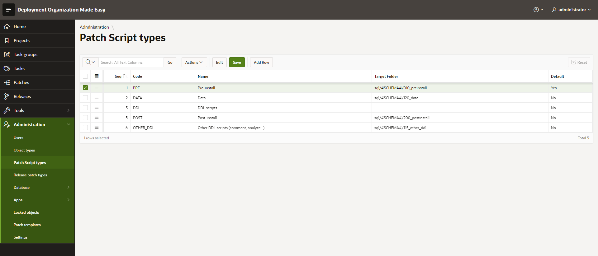

# Maintain Patch Script Types
## Access Patch Script Types Register
Select menu option Administration -> Patch Script Types

- code - is used within DOME core engine when recording DDL operations so please do not alter this value. When adding Your new patch script types You may define the code as You like... but for those 6 existing, please leave them as-is.
- target folder - has the same meaning as for object types (see manual [https://github.com/zorantica/dome/blob/main/manuals/005%20-%20Administration%20-%20Object%20types.md](005 - Administration - Object types.md))
- default Yes/No - when manually adding a script to a patch, this type is set by default

For "DDL" acript type there is no need to define target folder. Target folders are determined based on object type (table, PLSQL package, sequence, procedure...)