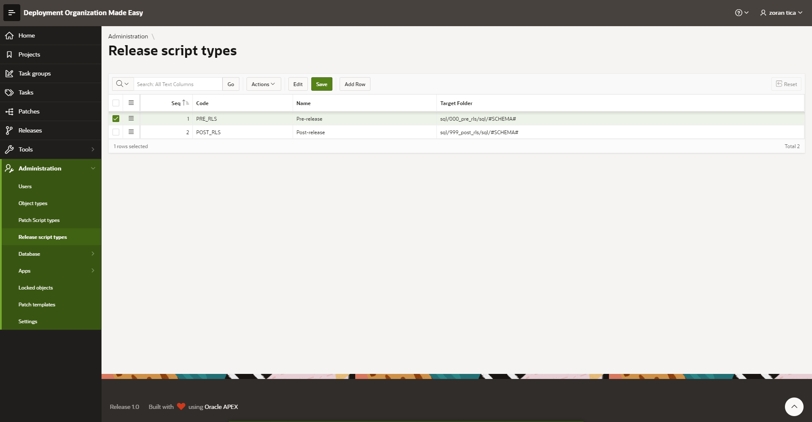

# Maintain Release Script Types
## Access Release Script Types Register
Select menu option Administration -> Release Script Types

Defines script types for scripts included on release level. 
You may define code, name and target folder.
