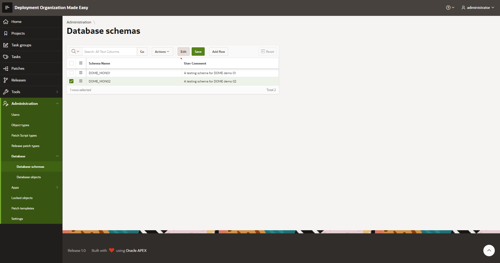
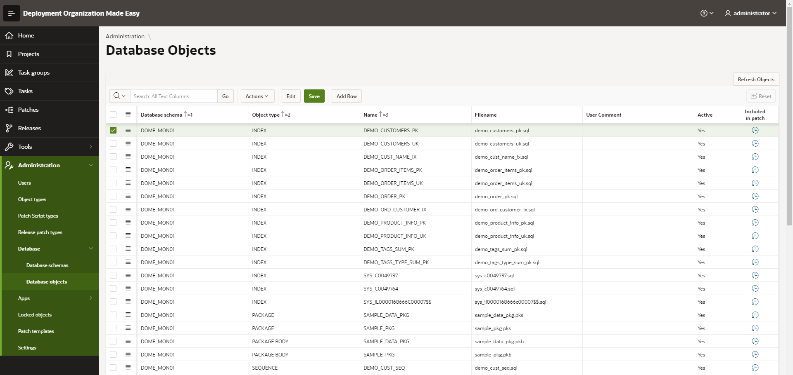
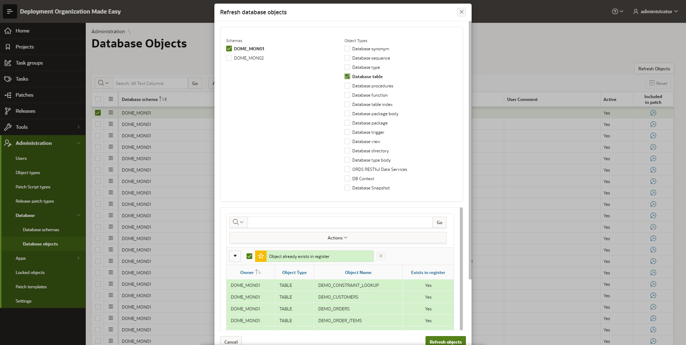
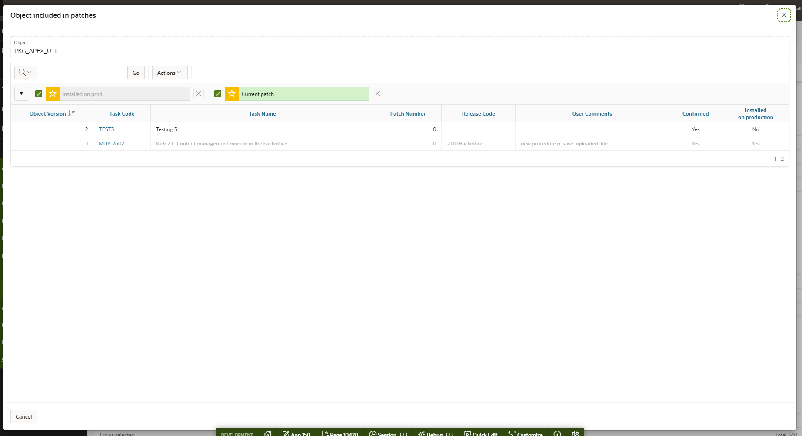

# Database Objects Register
In this administration module a DOME user can set up and maintain Database Schemas and objects within database schemas, which should be later on included in patches.
## Maintain Database Schemas
To access: Select menu option Administration -> Database -> Database schemas

You should simply add all database schemas, which should be covered by DOME (by monitoring or manual scripts generation).
## Maintain Database Objects
To access: Select menu option Administration -> Database -> Database objects

Following data can be maintained:
- database schema - a schema in which is object located
- object type - selected from defined object types (see [005 - Administration - Object types.md](005 - Administration - Object types.md))
- name - object name
- filename - a filename used for generated object script file (for patch or source code)
- active Yes/No - if object is active (inactive objects are not provided in a list of objects to be included in patch)

If DOME is set up to monitor certain database schema for executed DDL statements, this register is maintained automatically and objects are added immediately when they are created or altered.
In case of DROP statement objects are marked as non-active.
## Refresh Object List from Schema(s)
On database objects maintenance page there is a button "Refresh objects" in upper right corner. With click on this button a new modal page opens:

User should select desired schemas and object types, and click on Refresh objects button in order to refresh a register. 
New objects are added and missing (dropped) are marked as inactive.
## Object's History Insight
For every object there is a clock icon within "Included in patch" column.
With click on this icon a modal page with insight in object's history is displayed:

On this page a user will have insight in following data:
- in which patches an object was included and in which version (task code, task name and patch number)
- in which releases an object was included
- what was changed (user comments)
- if patch is confirmed or not
- if patch is installed on production or not

A patch, on which a currently logged user is working is colored in green (if object is included in such a patch at all).

Task code is provided as a link and it opens a page with patch details.