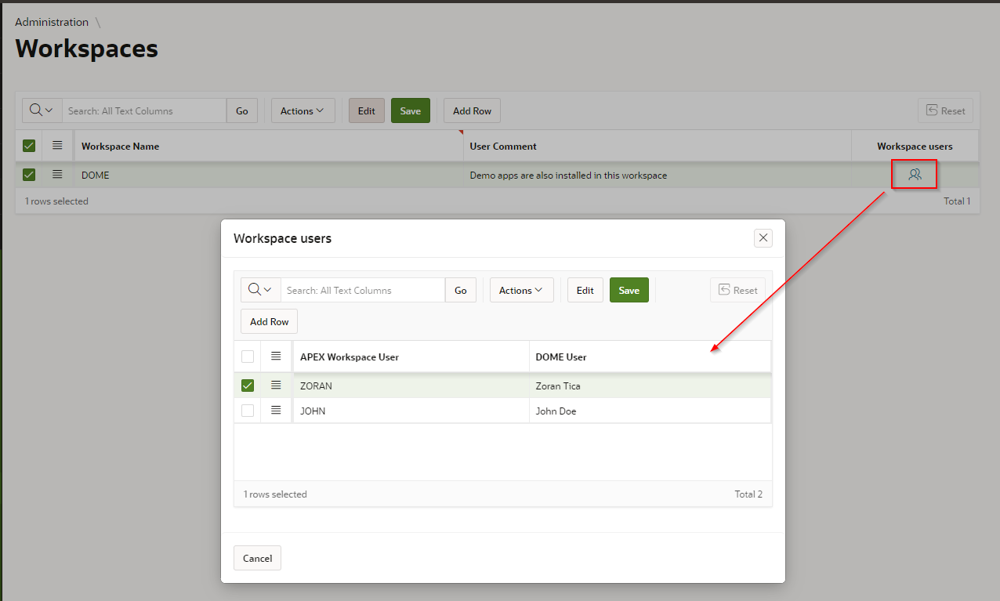
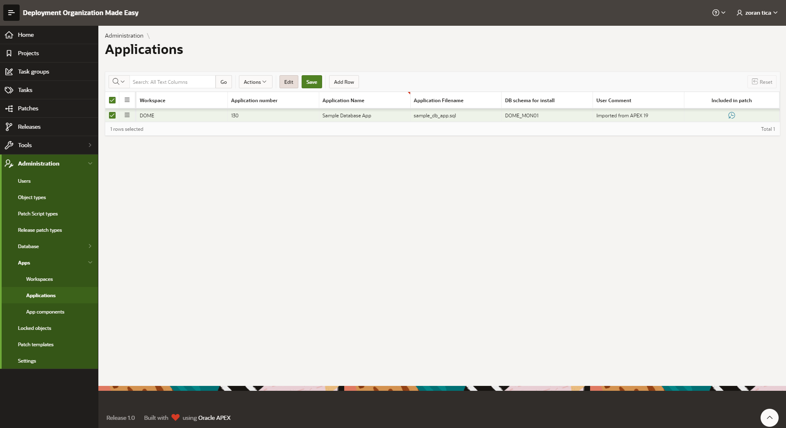
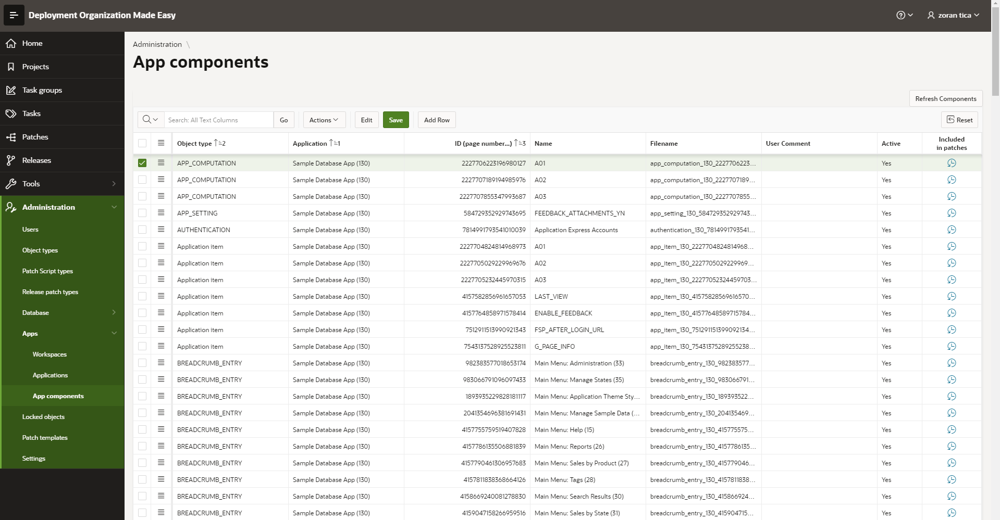
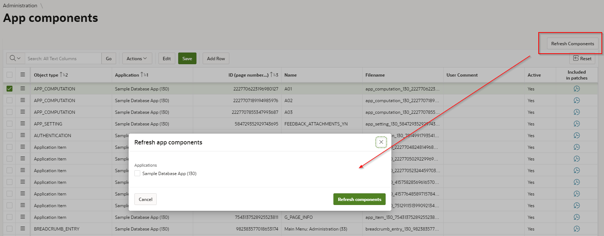

# Workspaces, Applications and Components Register
In this administration module a DOME user can set up and maintain Workspaces, Application and Application Components, which should be later on included in patches.
## APEX Workspaces
### Workspace Register
To access: Select menu option Administration -> Apps -> Workspaces

### Link APEX users (developers) with DOME users 
For every APEX workspace it is possible to link APEX users with DOME users. This is useful later on, when DOME user is adding APEX application components to patches. Component list can be filtered for components modified by current DOME user. 
A page for user linking is opened with click on icon within "Workspace users" column:

DOME users should be selected from a drop down list while APEX usernames should be typed in.
## Applications Register
To access: Select menu option Administration -> Apps -> Applications

For every application a following data can be maintained:
- workspace - selected from previously enetred workspaces (drop down list)
- application number
- application name
- filename, which will be used for patch script file generation
- database schema, from which an application can be installed; it can be selected from previously entered database schemas (see [Database Schemas Maintenance](https://github.com/zorantica/dome/blob/main/manuals/010%20-%20Administration%20-%20Database%20Objects%20Register.md#maintain-database-schemas) )
- comment

Application History Insight can be accessed by clicking on icon within column "Included in Patch" (explained [here](https://github.com/zorantica/dome/blob/main/manuals/010%20-%20Administration%20-%20Database%20Objects%20Register.md#objects-history-insight) )

## Application Components Register
To access: Select menu option Administration -> Apps -> App Components

For every application component a following data can be maintained:
- object type - selected from a list of component types (read more [here](https://github.com/zorantica/dome/blob/main/manuals/005%20-%20Administration%20-%20Object%20types.md) )
- application - selectde from a list of applications already entered in DOME
- ID - APEX component number
- name
- filename - a filename used for generated patch script files
- comment
- active Yes/No flag

Application History Insight can be accessed by clicking on icon within column "Included in Patch" (explained [here](https://github.com/zorantica/dome/blob/main/manuals/010%20-%20Administration%20-%20Database%20Objects%20Register.md#objects-history-insight) )

### Refresh Components Register
Usually there is no need to maintain components register manually. A DOME user can quickly refresh components register (add new objects, modify existing ones or set objects as inactive) for a selected application(s).
With click on a button "Refresh Components", a new page with application list opens.

User should select desired application(s) and click on Refresh components button.
After some time the dialog page closes and component register is refreshed.
