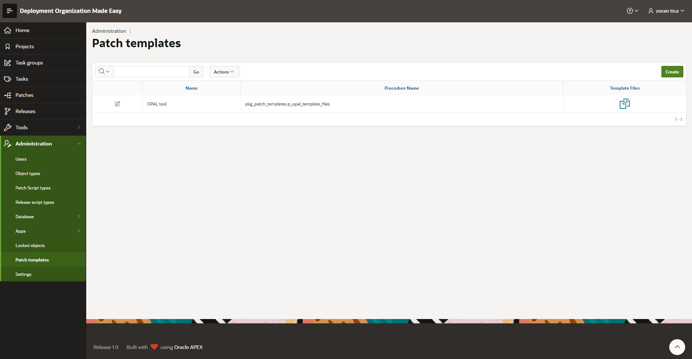

# Patch Templates
In this administration module a DOME user can set up and maintain different patch templates.
Patch templates define patch scripts output format and organization... and every template should be created for a specific tool (for example SQLPlus, SQLcl, SQL Developer, [OPAL tools](https://github.com/daust/opal-tools)...) used to install scripts on target environments and (if needed) specific project.

Some examples:
- all patch scripts are merged into one single installation script and SQLPlus is used to install script on target environments (test and production)
- all patch scripts are distributed into target folders; supporting scripts for OPAL tools are also generated; OPAL tools is used to install script on target environments (test and production)
- all patch scripts are distributed into target folders; non-Oracle third party tool is used to CI/CD 

## Maintain Patch Templates
To access: select menu option Administration -> Patch templates

