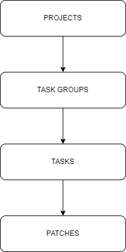

# Patches Organization Hierarchy
Patches are organized in following way:

Topmost entity is a project and within the project it is possible to set up different parameters and settings (see TODO).
Below is a task group and it equals to Jira Epic or some major functionality upgrade (new module and similar).
Third level is a task and it equals to Jira ticket or some basic functionality upgrade within task group.
Final level is a patch, where all installation scripts are prepared handled.

One task can contain multiple patches and this is implemented for two reasons:
1. multiple developers can work on the same task and each of them opens it's own patch
2. revisions after testing - if testing is not successful then a new patch should be opened for the same task