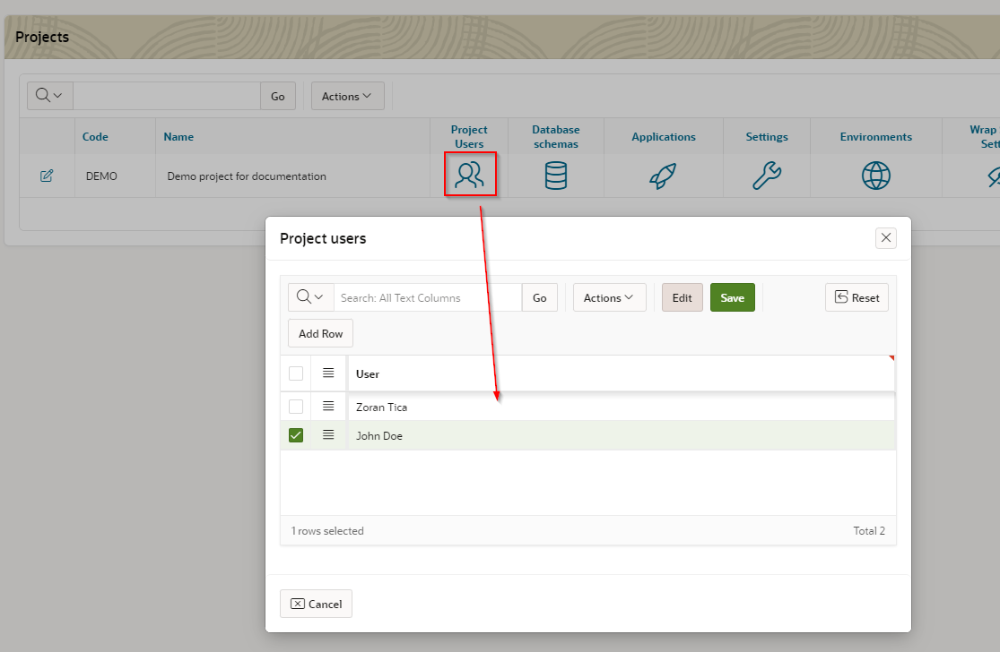
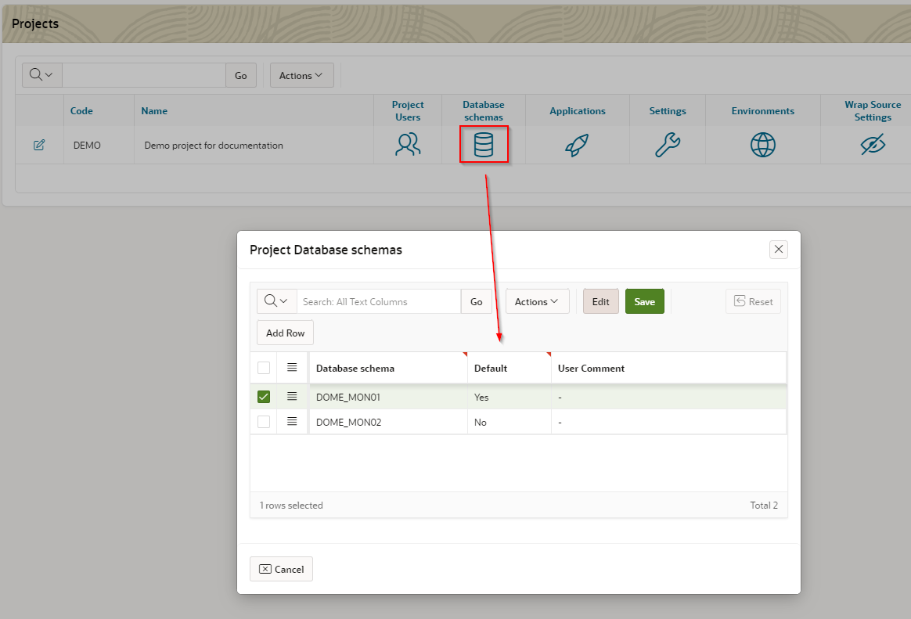
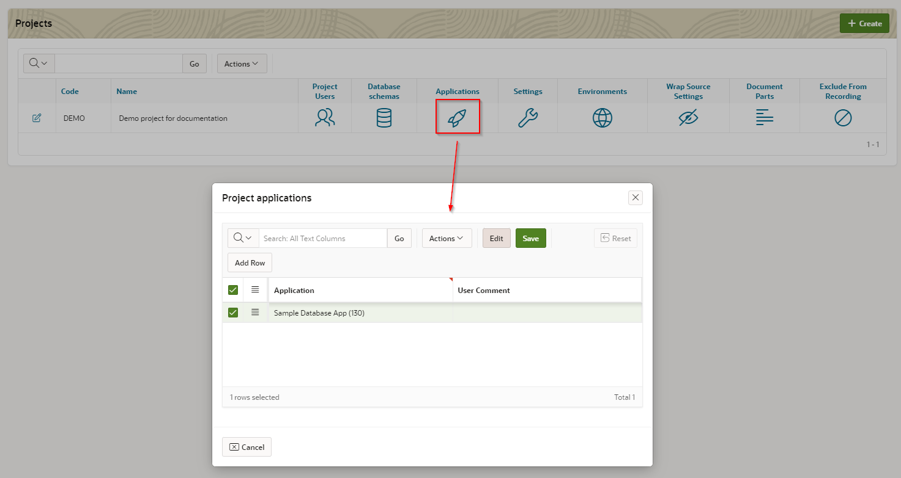
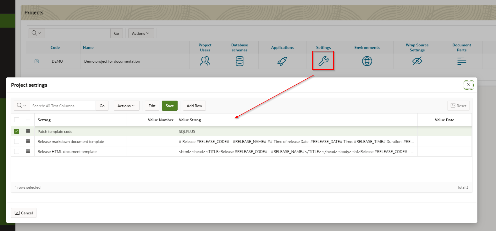
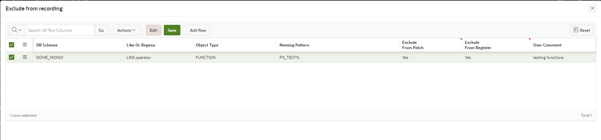
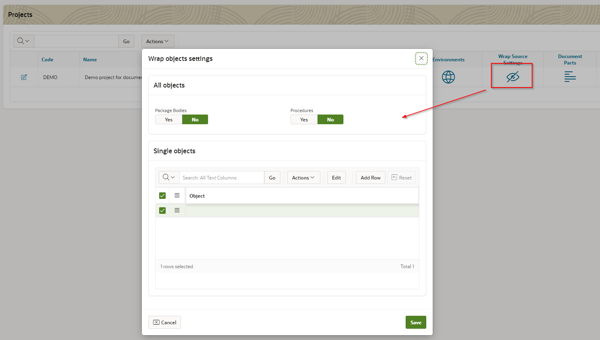
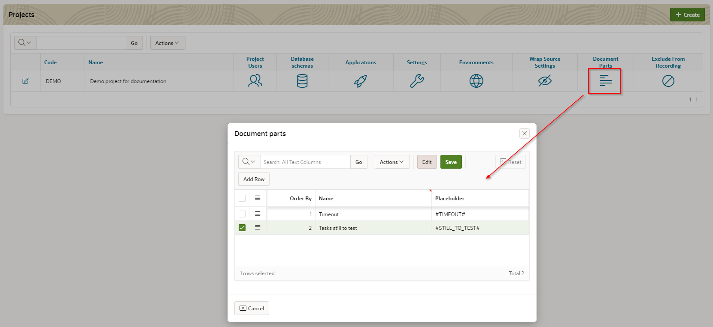

# Projects
Projects are topmost entity within patches hierarchy.
To access: select menu option Projects

2 main data for projects are code and name.
Beside code and name, following parameters and settings can be set up for a project:
- assign DOME users to project
- assign database schemas and applications to project
- set up basic project settings
- define different target environments (test, academy, schooling, production...)
- set up source wrapping
- define document parts for release documentation generation
- set up objects, which should be excluded from DDL monitoring / recording

## Assign DOME users to project
Users are selected from previously entered DOME users (see here TODO).

## Assign database schemas and applications to project
Schemas are selected from previously entered DOME schemas (see here TODO).

Default schema is used within DOME engine for situations where database schema is expected but not defined. It should not happen... but better safe than sorry :)

Applications are selected from previously entered DOME applications (see here TODO).

## Set up basic project settings
Currently there are 3 parameters, which can be set for a project:
- Patch template code - defines script output format (should be selected from already defined templates, see here TODO)
- Release HTML document template - a template text used for release documentation generation (in HTML format)
- Release markdown document template - a template text used for release documentation generation (in markdown format)

## Define different target environments
For every target environment a following data should be set:
- environment code - used internally for DOME
- environment name - displayed in DOME and documentation
- production marker Yes/No - if defined environment is production or not
- external system code - if external system for generated patch scripts installation requires environment code to be provided

## Set up source wrapping
DOME provides an option to automatically wrap PLSQL source when generating patch scripts.
Source in development database stays intact - wrapping is done on-the-fly during scripts generation process.

If all PL/SQL packages or procedures should be wrapped, an appropriate switch should be set in "All objects" region.
Other option is to select single object(s) in "Single Objects" region below.

## Define document parts
Document parts are used for release documentation generation.
For every release, a document part text should be entered manually (see here TODO) and will be automatically integrated in produced documentation (placeholders in template will be replaced with entered text)..

## Objects to exclude from recording
When recording DDL scripts for patches, it is possible to define which objects should be excluded from recording.

Following data should be set for every condition:
- database schema - selected from previously defined schemas (see here TODO)
- "like" or "regular expression" condition type
- object type - selected from previously defined object types (see here TODO)
- naming pattern - should be written in SQL syntax (for example "like" can use wildcard characters)
- exclude from patch - if set, recorded object scripts will not be included in patches
- exclude from register - if set, recorded object will not be included in DOME database objects register
- comment