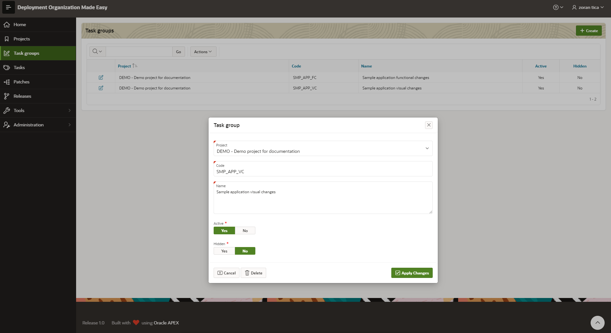

# Task Groups
To access: select menu option Task Groups

For every task group a following information should be set:
- project
- code and name
- active Yes/No - if task group is still active or not (finished task groups should be set as inactive)
- hidden Yes/No - for hidden task groups, tasks and patches are not displayed on tasks or patches list pages
