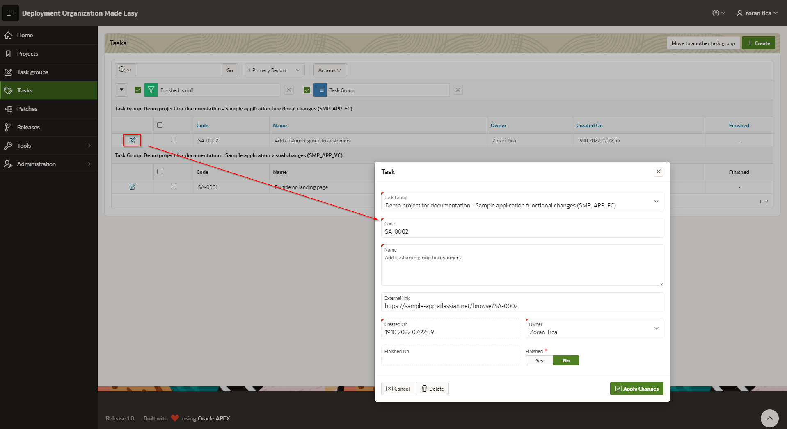
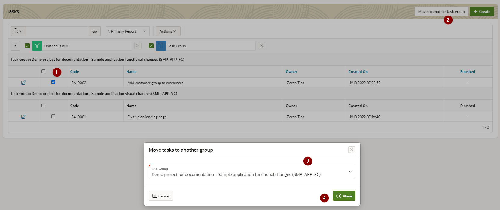

# Tasks
To access: select menu option Tasks

For every task a following information should be set:
- task group - selected from already created task groups (see TODO)
- code and name
- external link - enter URL for ticket if ticketing system like Jira is used 
- owner - a DOME user, who is an owner of the patch
- finished Yes/No - a flag if task is finished

When a new task is created, a new first patch for this task is created automatically.

## Move multiple tasks to another task group
First, desired tasks should be marked with checkbox for movement to another group (step 1, see pic below).
After tasks are marked for movement, a new target task group should be selected:
- click on button "Move to another task group"
- select a task group
- click on button "Move"

 