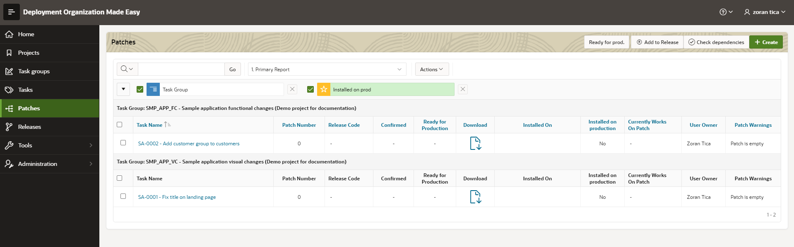
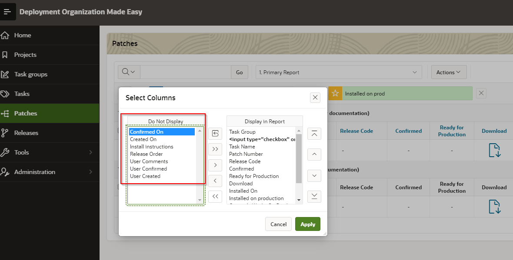
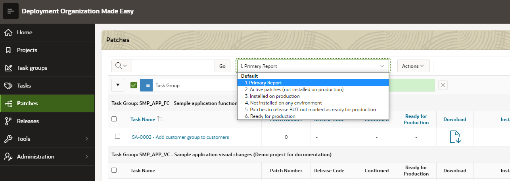
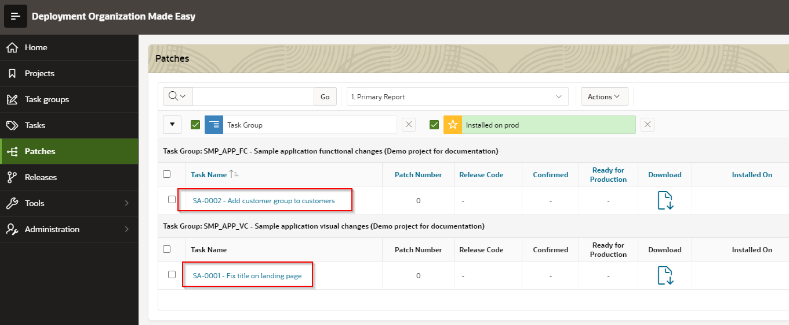
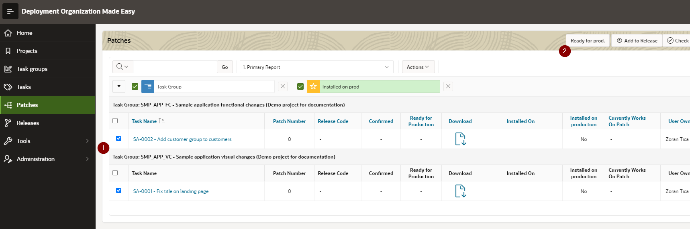

# Patches Register
To access: select menu option Patches

By default, basic patch information are displayed: 
- task name and patch number
- release code, in which a patch is included
- if patch is confirmed or not (developer finished working with patch and scripts are ready for download)
- if patch is ready for production (confirmed by testers or other responsible person)
- environments, in which is patch installed
- if patch is installed on production or not
- which DOME user currently works on patch
- owner (DOME user)
- different warnings for patch (for example if patch contains no objects or scripts - patch is empty)

Beside that, there are additional columns for patch register / ineractive report, which can be displayed (see pic below):
- which DOME user confirmed a patch and when
- when was a patch created and by which DOME user
- special scripts installation instructions 
- patch order in release (if specified)
- additional comments

## Additional Filters / Layouts
Patches register is created as APEX Interactive region and DOME user can create additional filters and layouts.
There are 6 pre-defined filters:
- primary list of all patches
- active patches (not installed on production)
- patches installed on production
- patches not installed on any environment
- patches included in release but not confirmed
- patches marked as ready for production

## Access Patch Details Page
Page with patch details opens with click on task name in Task name column.

## Mark multiple patches as ready for production
First mark desired patches with checkbox and then click on button "Ready for prod.".

