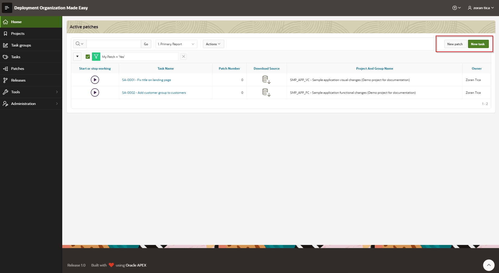

# Creating a new Patch
There are multiple ways to create a new patch:
1. by creating a new task from tasks register (patch is created automatically)
2. by creating a new task from landing page (patch is created automatically)
3. by creating a new patch from patches register
4. by creating a new patch from landing page

## New task from tasks register
*(see TODO)*

## New task or patch from landing page

## New patch from patches register
*(see TODO)*