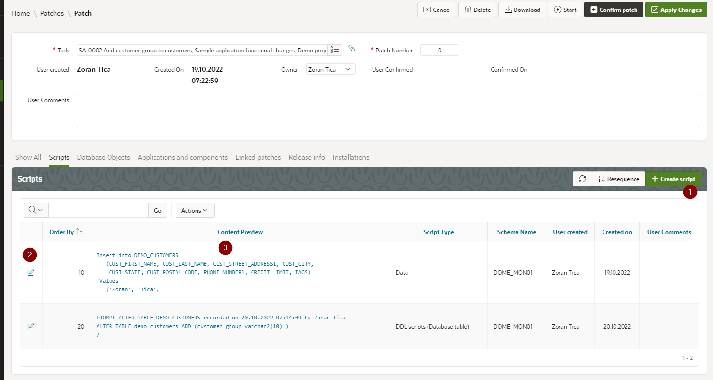
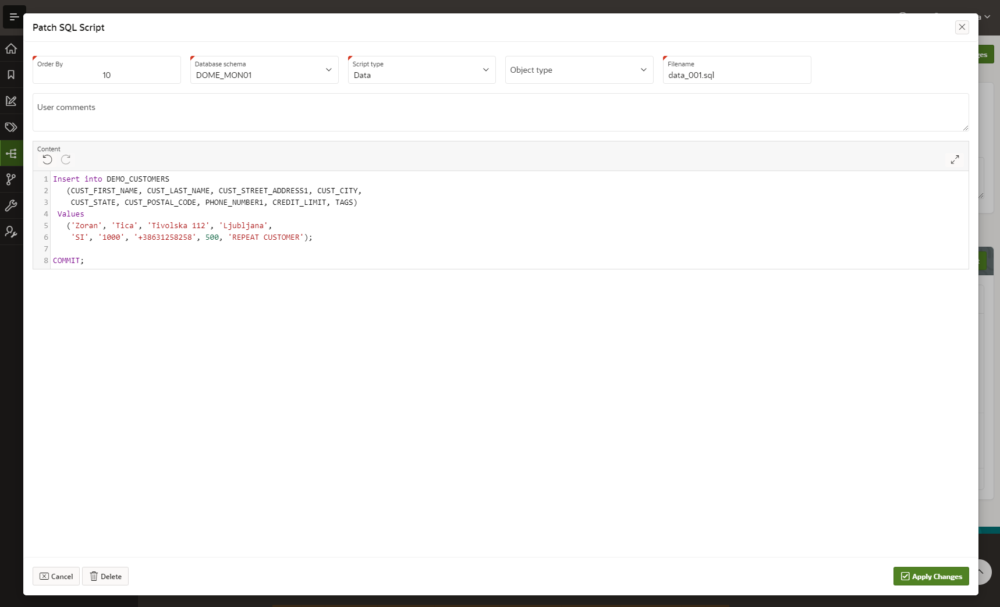
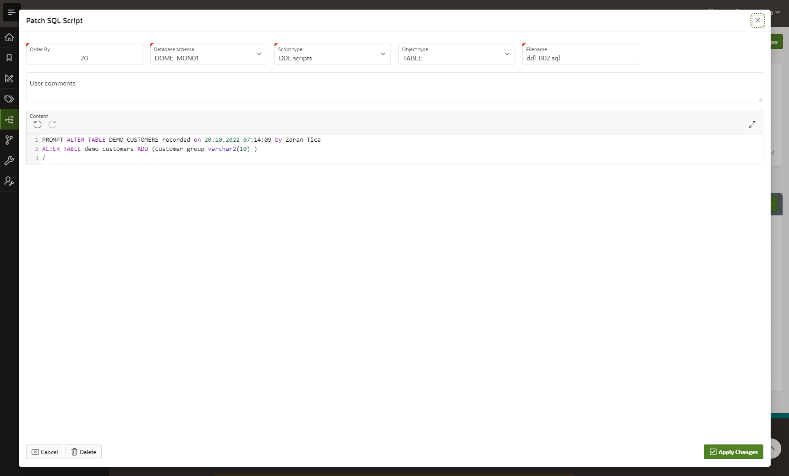
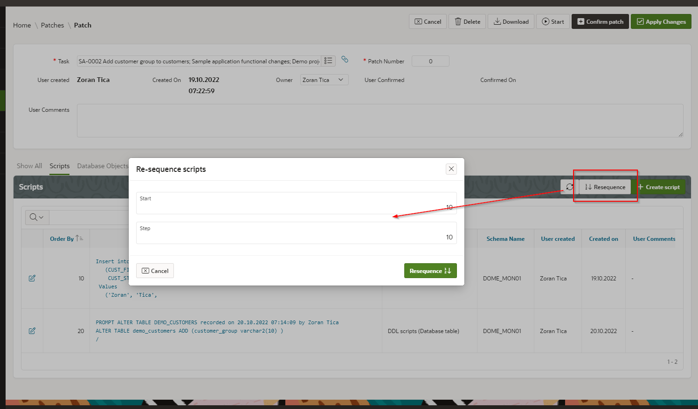
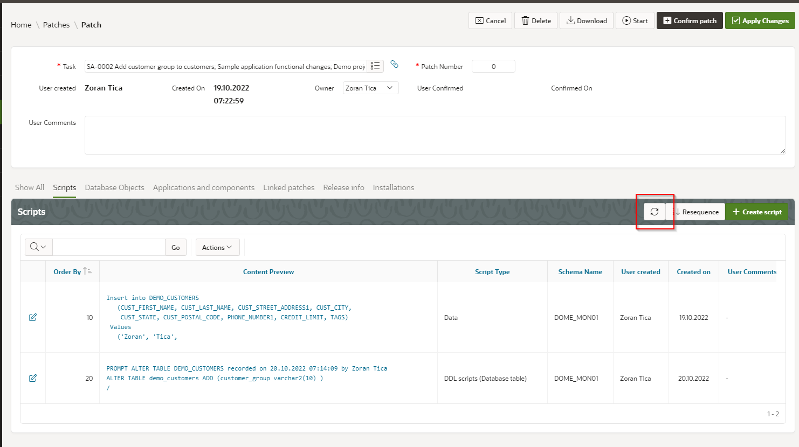

# Working with Patch Scripts
Patch scripts are sccessible in lower part of the page, "Scripts" tab.

## Create or Edit a Script
To create a new script, DOME user should click on "Create script" button (1).
To edit existing patch script, DOME user should either click on appropriate pen icon or script content preview (2, 3).

## Script Definition
For every script following data should be defined:
- order by - used when generating patch installation scripts to order scripts
- database schema - in which schema a script should be executed; so, one patch can support multiple target schemas
- script type - selected from previously defined script types (see TODO); this defines generated patch scripts output folder
- object type - when produced script is DDL script for certain object type (table, index, sequence...) then appropriate object type should be selected; this defines generated patch scripts output folder and this folder is defined within object types (see TODO)
- filename - a name used for generated patch script file 

A script length is practically not limited... it is stored as CLOB in database and CLOB editing plugin is used in APEX UI
(thank You Marko Goricki https://github.com/mgoricki/apex-plugin-code-editor and Ronny Weiss https://github.com/RonnyWeiss/APEX-CLOB-Load-2). 

## Resequence Scripts
If patch scripts are packed tight by order by and there is no space to insert a new script in between, there is an option to re-sequence order by for existing scripts.
This can be achieved by clicking on Resequence button. A new page opens, where a new starting order by number and step between numbers should be entered:

## Refresh Scripts
When new DDL scripts are recorded from monitored schemas, they are not automatically displayed on already opened patch page.
Therefore a Refresh button (with refresh icon) is provided. 
It simply refreshes data in scripts region and displays newly created scripts. This way there is no need to refresh a complete page.

