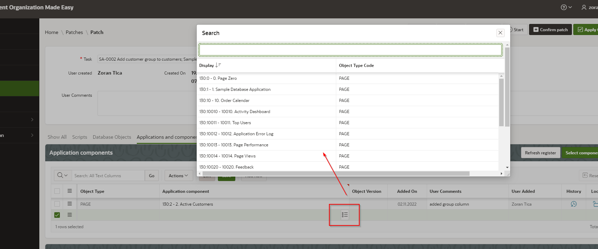
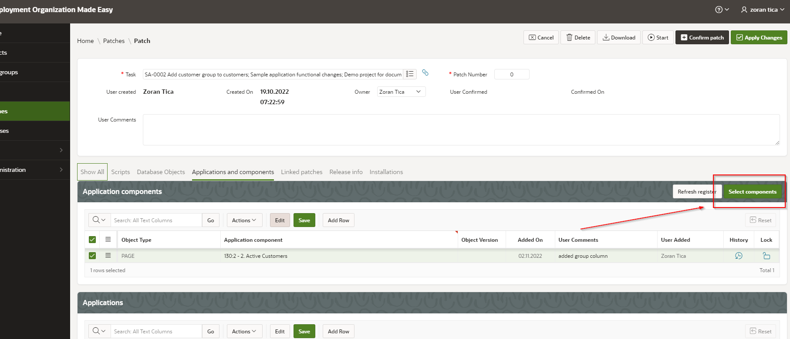
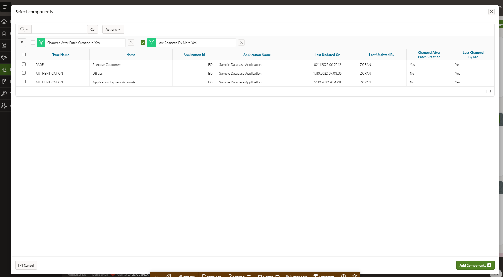

# Adding Application Components to a Patch

There are 2 ways, in which application components can be added to a patch:
1. single component selection - selecting a component from popup list (interactive Grid functionality)
2. multiple components selection - opening a popup page with component list and selecting multiple components

## Single Component Selection
DOME user should add a new row to Application Components region and select a component from a popup list:

## Multiple Components Selection
DOME user should open a popup page with component list, mark multiple components with checkbox and add them to a patch by clicking on Add components button.

There are 2 important columns in component list report, which can have values Yes or No:
- Changed after patch creation - if component's last change (updated by) is newer than patch creation time then value is Yes
- Last Changed by me - if current DOME user was the last developer, who updated the component then value is Yes

This way a DOME user can quickly filter components list and determine, which objects he changed and when and add them to patch. This lowers a chance of forgetting components, which should be included.