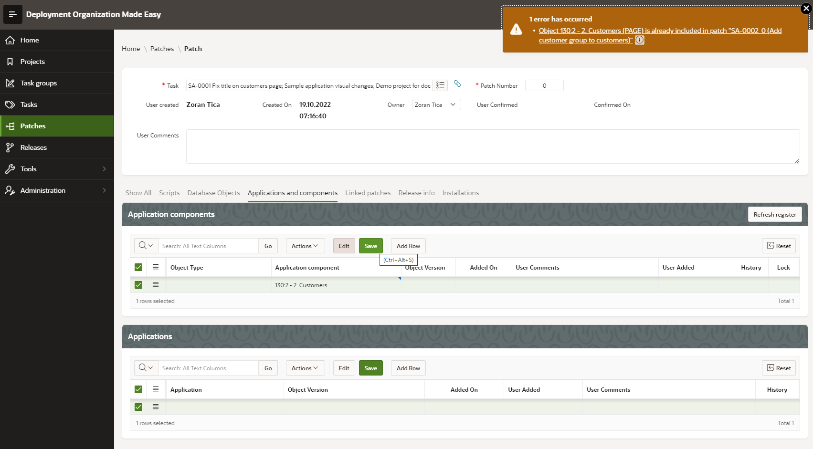
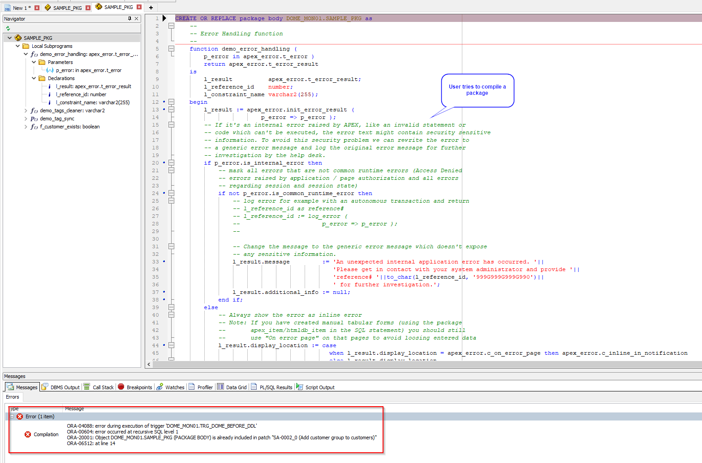
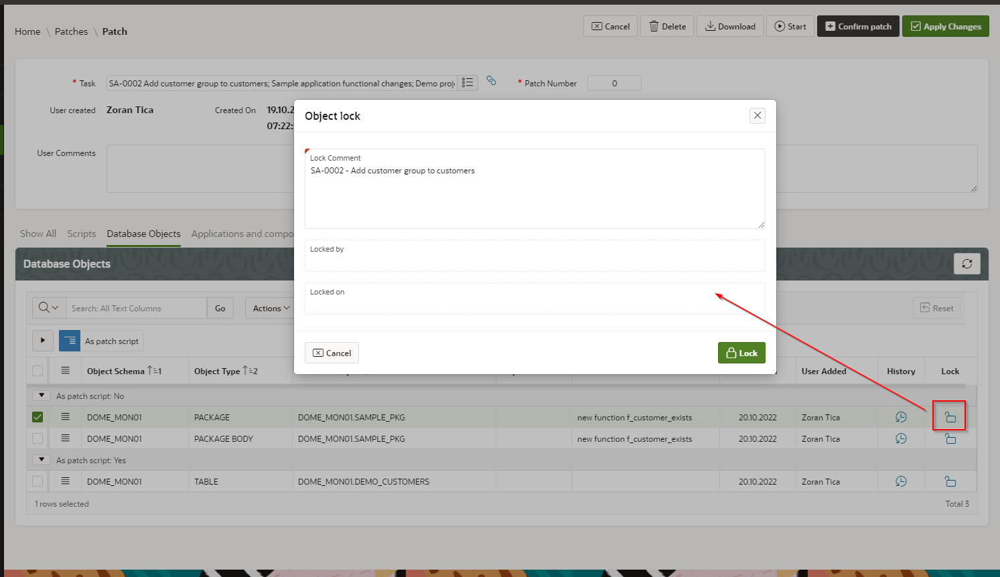
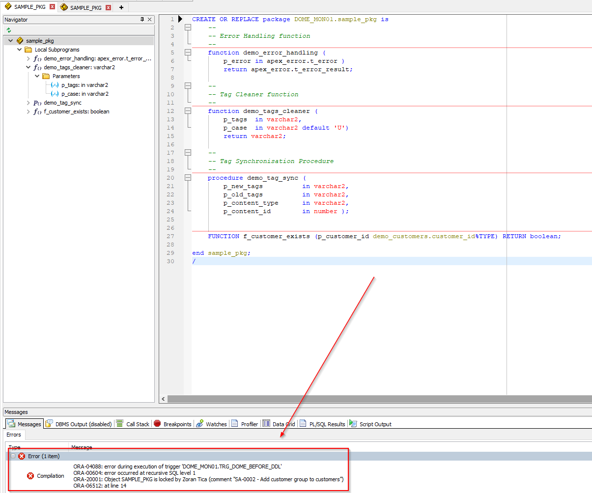
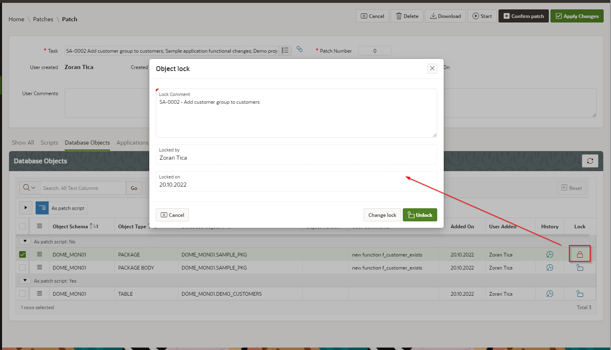
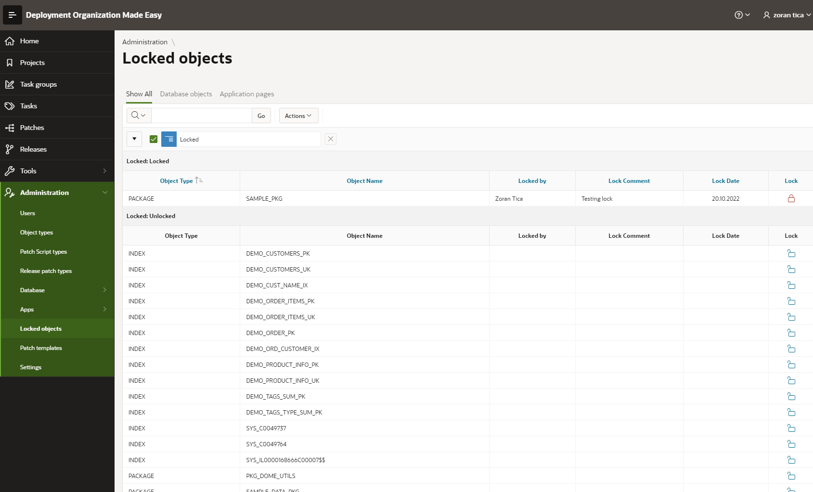

# Handling Concurrency and Locking Objects
## Handling Concurrency within DOME
When certain object is included in a patch, in can not be included in another patch UNTIL first patch is confirmed.
This way a concurrency is controlled and DOME user gets an information that another developer is working and changing an object.

For example, page 2 in sample application is already included in patch SA-0002 (Add customer group to customers).
DOME user tries to add this page 2 to another patch (for example SA-0001). 
He will get an error with explanation, in which patch is page 2 already included.

Then he should either contact a patch SA-0002 owner and check when will he release the object (confirm it's patch) OR he should link his patch SA-0002 to patch SA-0001 and include page 2 in patch SA-0001.
As mentioned previously, linked patches provide a functionality to share same objects between patches (include same objects).

Those controls are implemented on database level too and not only within DOME UI. They work also during DDL recording on monitored schemas.
For example: 
- a database package SAMPLE_PKG is already included in patch SA-0002, patch is still not confirmed 
- another (or same) user is working on patch SA-0001
- he opens a database package SAMPLE_PKG in SQL Developer, TOAD or some other client PL/SQL editing software 
- he tries to compile the package
- DOME is informed that package is compiled; it checks if package is already reserved (included in another active patch) and throws an error
- compilation is terminated with error and package code changes are not stored in database

## Explicit Locks on Database Objects
When DOME is handling concurrency for objects, it checks object inclusions within active patches and throws errors if necessary.
It does not automatically lock database objects on database level.
This means that, even if object (for example database package) is included in patch, someone who does not use DOME can alter and compile the package.
But...
DOME provides functionality to explicitly lock an object on database level for a current user. This way objects are prevented from any alteration by other users.

### How to lock an object
Object lock can be achieved from patch details page or from Administration module.
On patch details page (Database objects tab) there is an lock icon for everz object(see pic below).

DOME user should write down a comment, why is he locking the object. By default, a comment text is the name and the code of the patch.
If some other database user tries to compile a package, an error is thrown:

After the object is locked, an icon changes it's shape to locked lock. With same activity (click on lock icon) an object can be unlocked:

Change lock button changes the lock comment, while Unlock button removes a lock from object.

### Locked objects list
To access: select menu option Administration -> Locked objects

Locked objects are displayed on top of this list.
On this list it is possible to lock or unlock objects.