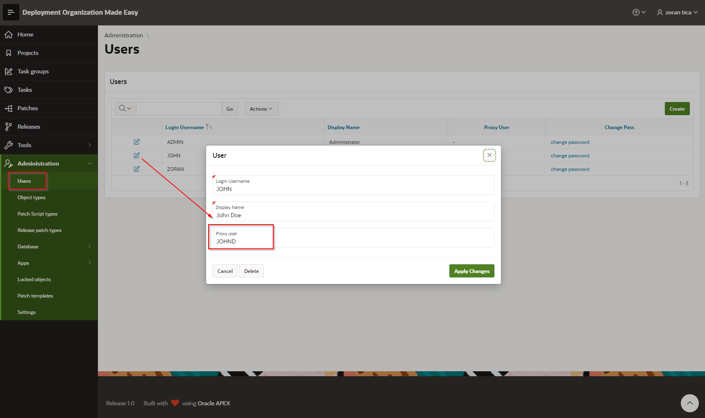
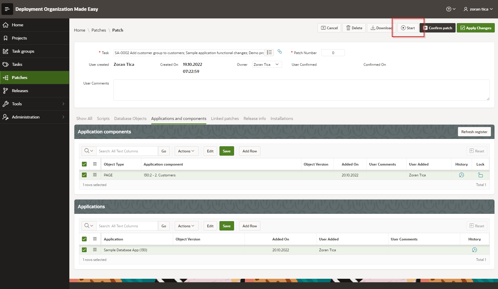
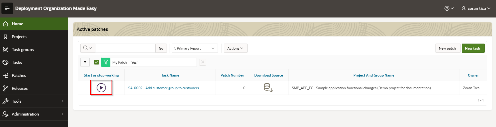
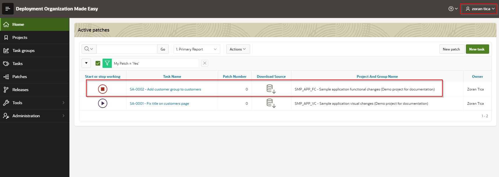
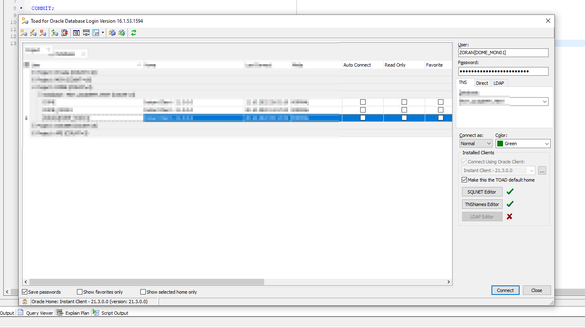
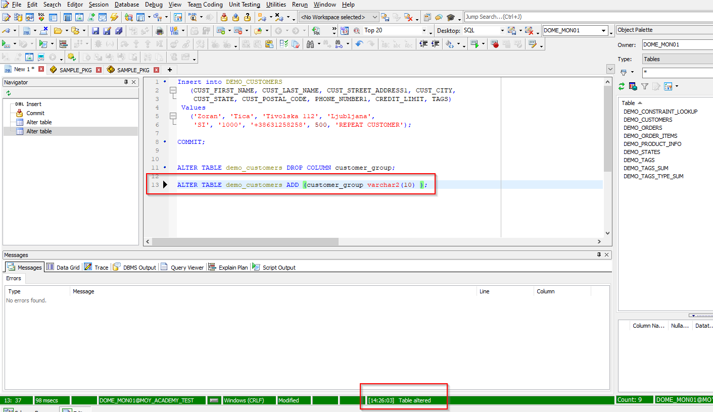
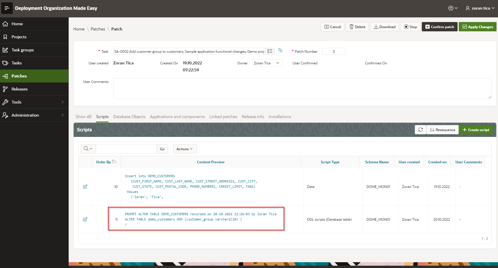
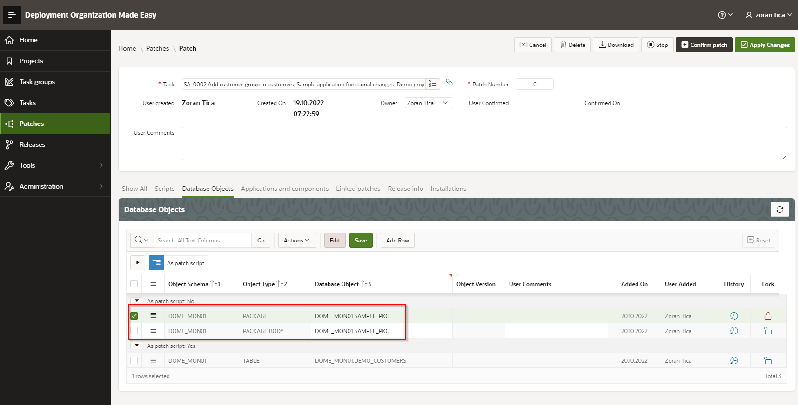

# Recording DDL Operations
DOME provides a functionality to configure database schemas for monitoring and recording executed DDL operations.
This functionality lowers a possibility that some DDL statements are forgotten to be included in patch and speeds up patch preparation (no need for copy-paste, DOME handles an order of executed statements...)

## Database Schema Setup
It is highly recommended to install DOME in separate schema - in further text this schema will be referenced as the DOME schema.
This lowers DOME intrusion into project schema(s), which contain data, program logic or they are used by APEX applications.

Following activities should be conducted on database in order to set up a DOME monitoring on desired database schema:
- create objects in monitored schema 
- - package PKG_DOME_UTILS (use script "install/DDL recording setup/01 - pkg_dome_utils.sql")
- - synonym PKG_DOME_INTERFACE for PKG_INTERFACE in DOME schema (use script "install/DDL recording setup/03 - synonyms.sql")
- - database triggers TRG_DOME_BEFORE_DDL and TRG_DOME_AFTER_DDL (use script "install/DDL recording setup/04 - triggers.sql")
- set up grants on database packages (use script "install/DDL recording setup/02 - grants.sql")
- - DOME user should have execute grant on PKG_DOME_UTILS package from monitored schema
- - Monitored schema user should have execute grant on PKG_INTERFACE from DOME schema
- for every developer create a database user and grant proxy access to project schema(s) (use script "install/DDL recording setup/05 - proxy user.sql")

## How Schema Monitoring Mechanism Works
When a DDL statement (for example CREATE TABLE, CREATE OR REPLACE PROCEDURE...) is executed on monitored schema, before and after DDL triggers TRG_DOME_BEFORE_DDL and TRG_DOME_AFTER_DDL are activated.
They send data to DOME schema via interface package (procedure call) such as:
- object owner
- object type
- object name
- statement text
- triggering event (create, alter, drop, comment)
- proxy user

DOME then decides what to do with this data and takes appropriate actions such as:
- handles concurrency - rises an error if object is included in active patch (see TODO)
- if an object is locked, it rises an error and prevent object from alteration
- stores passed statement in appropriate patch

## Set up DOME to record Statements in a Patch
Proxy user created on database and DOME user created in DOME should be linked.
This way the DOME will know, which user actually executed the statement. 
A proxy user name (who executed the statement) is passed from monitored schema to DOME, and based on that information the DOME user can be determined.

### Link proxy and DOME users
This can be achieved in DOME users register (see TODO)

### Select a Patch, in which to record Statements
A DOME user should start working on a patch.
This way a patch is marked for recording.
To start working on a patch, a DOME user should simply click on a "Start" button (patch details page) or start icon (landing page):

Same button / icon is used to stop working on a patch.
When DOME user stops working on a patch, DDL statements are not recorded in a patch any more.

## Example
### Setup
DOME is installed in DOME schema.
Monitored schema is named DOME_MON01.
Proxy user is ZORAN, DOME user is ZORAN and they are linked.
All objects and grants are set as described in "Database Schema Setup" chapter.
### Start Working on Patch
User "Zoran" logged into DOME and started working on a patch SA-0002:

### Log into Database
Database user ZORAN logged in as proxy user on schema DOME_MON01:

### Execute ALTER TABLE DDL Statement
ZORAN executed ALTER TABLE statement (logged as proxy on DOME_MON01 schema) where APEX Demo App is installed.

DDL triggers were activated and data about statement and proxy user is passed to DOME.
DOME figured out that:
- proxy user is ZORAN
- DOME user is ZORAN (users were previously linked)
- DOME user ZORAN in currently working on patch SA-0002

So, DOME inserted ALTER table statement into patch and also included a comment on who executed a statement and when:

A new patch script for table DDL statements was created and all other recorded table DDL statements will be added to this script.
For other object types separated scripts will be created (for example sequence, comment...).

### Make a Change to a Package
The same proxy user ZORAN opened a package SAMPLE_PKG in editor, added a new function to specification and body and compiled them both.
Both specification and body are added to a patch:

