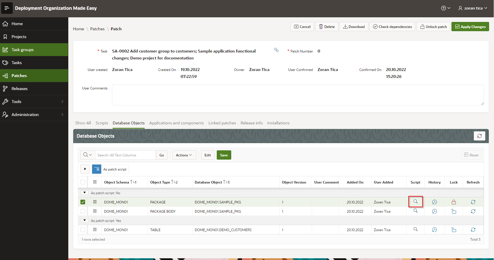
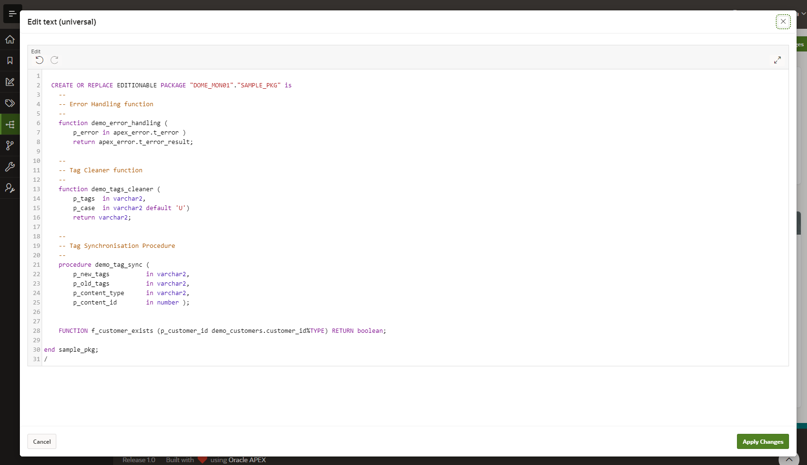
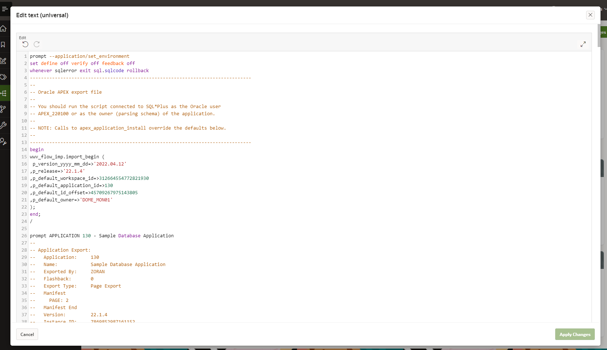
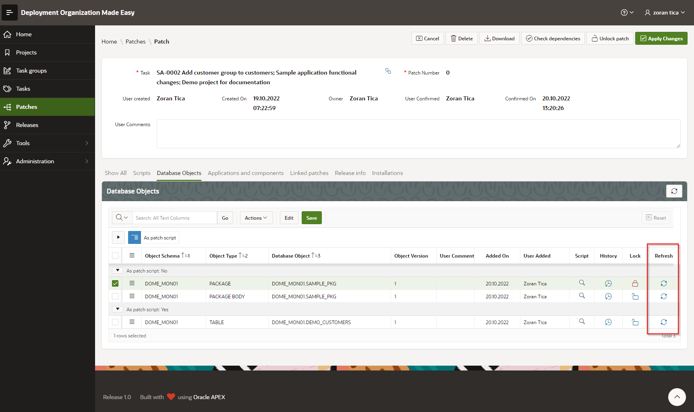

# Confirming a Patch, Additional activities and Scripts Download
When a DOME user / developer finishes working on a patch and all scripts, objects, application components and applications are included, the user should confirm the patch.

## What happens when a Patch is confirmed
During confirmation process all database object scripts (for packages, procedures, functions, triggers, types...) are fetched from database using DBMS_METADATA API package and stored in DOME tables.
Also, all application components and applications scripts are fetched from APEX using APEX_EXPORT API package. They are also stored in DOME tables.
All objects in patch get next version number.

## Additional activities on confirmed Patch
When a patch is confirmed it is possible to:
- download patch installation scripts
- view a script for a certain database object, application component or application
- refresh a script for a single objects
- mark patch as ready for production and include patch in a release 
- enter installations data
- check dependencies

### Download Patch Installation Scripts
This can be achieved from patch details page (Download button) or patch register page (download icon in Download column).
Dialog page for download opens and with click on big "Download patch" button a ZIP file with scripts is downloaded.

### View a Script
An object script can be accessed by clicking on magnifier glass icon within Script column:

A modal page with script opens:

Application component scripts can be also accessed:

### Refresh a Script for a Single Objects
A script for a single object can be newly generated and stored in a patch without a need to unlock a complete patch.
This is useful for a scenario, where a problem with an object is detected during deployment on another environment.
Object source is then corrected on development database and a script is refreshed in a patch.   

A script can be refreshed by clicking on object's refrech icon in Refresh column:

### Mark Patch as ready for Production and include Patch in a Release
Those activities can be achieved on "Release info" tab:
- include the patch in a release
- mark patch as ready for production
- write down optional installation instructions and comments
- write down release notes

Marker "Ready for production" can be useful for determining patches, which are tested and safe to be installed on production.

Install instructions and Release notes can be used later on for patch or release documentation preparation.

#### Mark multiple Patches as "Ready for Production"
This can be achieved on patches list page.
A desired patches should be selected and Ready for prod. button should be clicked.

### Enter Installations Data
Installation data, if entered correctly, are very important for dependency checking and tracing, which object version is installed on which environment.
Also, it is important for evidence, which patch is installed on production.

One patch can be installed on the same environment multiple times.
This could happen if patch installation fails and it needs to be repeated AFTER the patch is fixed. 

If possible, those information should be populated automatically by patch scripts installation tools (SQLPlus, OPAL...). 

### Check Dependencies
Explained in manual TODO

## Patch unlocking
If needed, confirmed patch can be unlocked.
This might happen if patch installation fails and patch scripts and objects need to be fixed.
Patch unlocikng is possible ONLY if:
- all objects included in patch are in latest versions
- no object is reserved in another patch

If those conditions are not met, DOME will throw an error and prevent patch unlocking.
In that case a new patch must be created and problematic objects can be included in it.