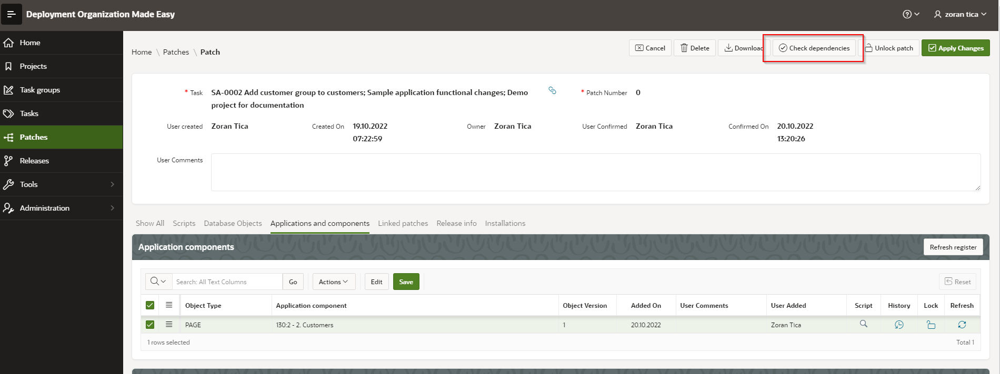
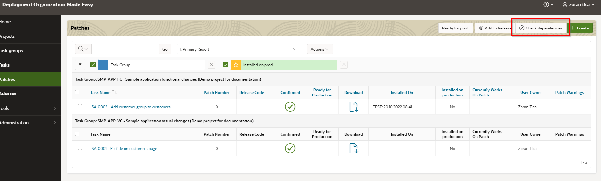
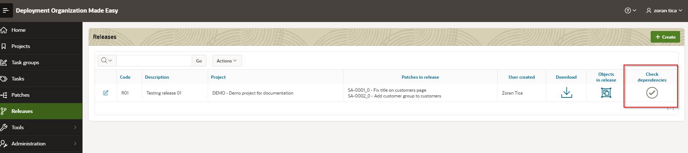
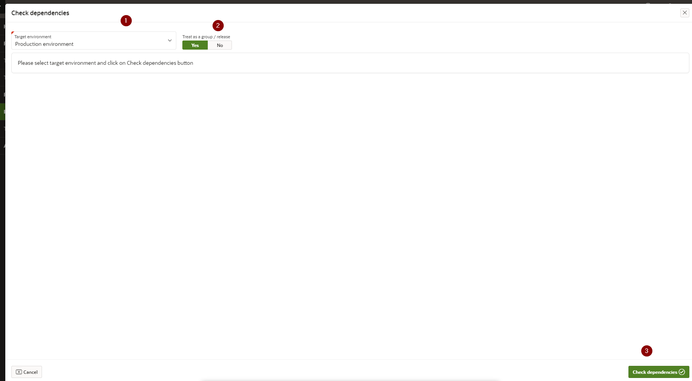
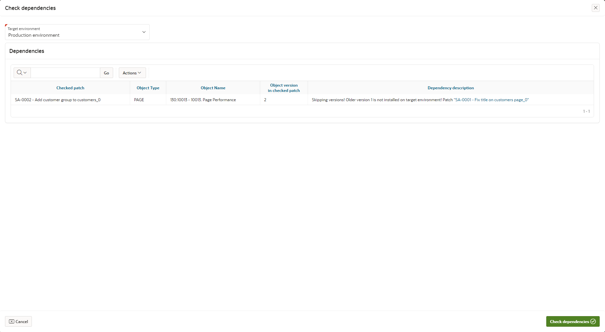

# Check Dependencies
Before installing a patch to a target environment, it is smart to check if it is safe to install it.
Some of the problems, which can occur are following:
- Overwrite newer versions of objects. Target environment contains a newer version of object comparing with current patch. If patch is installed, some functionality might be lost or some invalid objects may appear.
- Skipping versions. There are some object(s) from current patch with older version, which is not confirmed to be installed on production. This way some unwanted and untested functionality might end up on production.
- Linked patches. Linked patches should be installed together in a release.

Potential problems / dependencies can be checked for a single patch or for a group of patches, which are treated as release.

## Access Check Dependencies Page
Dependencies are checked and displayed on a modal page, which can be accessed from 3 locations:
- From patch details page
- From patches list page
- From releases list page

### From Patch Details Page
When a patch is confirmed, there is a button Check dependencies, which executes a check for current patch only.

### From Patches List Page
On this page it is possible to check dependencies for multiple patches at the same time.
User should select desired patches with checkboxes and click on button Check dependencies.

### From Releases list Page
On this page it is possible to check dependencies for all patches included in selected release.
User should click on check mark icon located in Check dependencies column.

## Conduct Dependencies Check
Dependencies check page looks like this:

First (1), a target environment should be selected from a list of existing environments for a project. A check is conducted for a selected environment.
After that a DOME user should choose how are selected patches going to be treated - as single patches or group of patches (2).
Difference is that group of patches should be installed on target environment within one release... and in that case inter-dependencies between selected patches are not checked.

After clicking on Check dependencies button (3) a check is conducted and a list of dependencies is displayed.

Example:
- page 10013 is included in 2 patches (SA-0001 and SA-0002)
- both patches are installed on test but not on production
- patch SA-0001 contains object version 1 and patch SA-0002 object version 2
- if patch SA-0002 is going to be installed on production... a skipping versions will happen because object version 1 from patch SA-0001 is not installed on production

Another example:
- page 10013 is included in 2 patches (SA-0001 and SA-0002)
- patch SA-0001 contains object version 1 and patch SA-0002 object version 2
- patch SA-0002 is already installed on production while patch SA-0001 is not
- if patch SA-0001 is going to be installed on production... an older object version overwrite will happend

