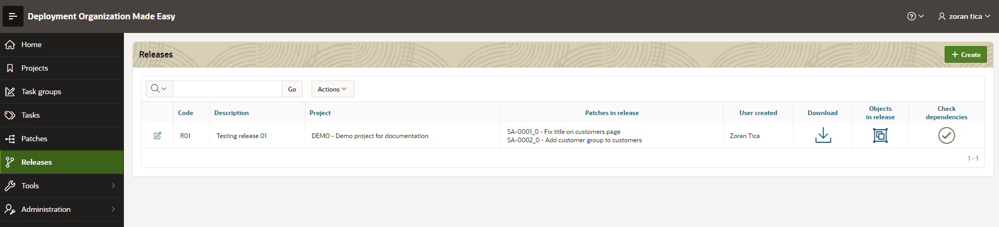
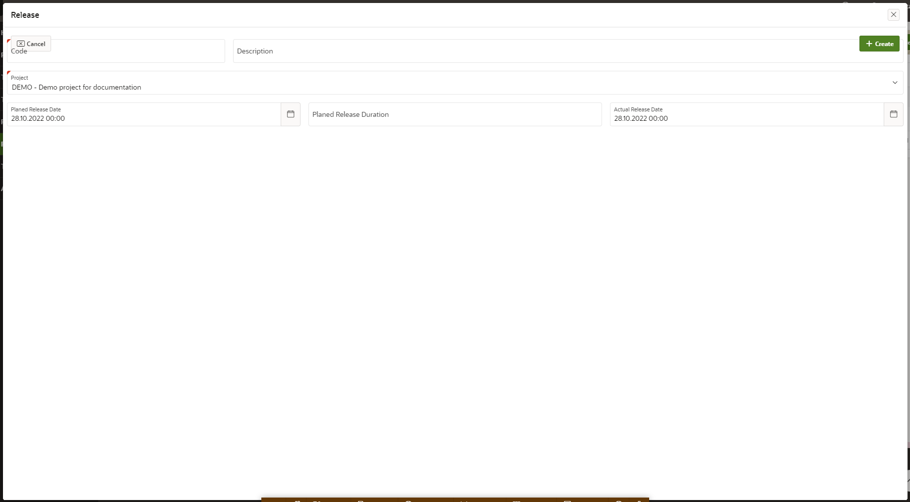
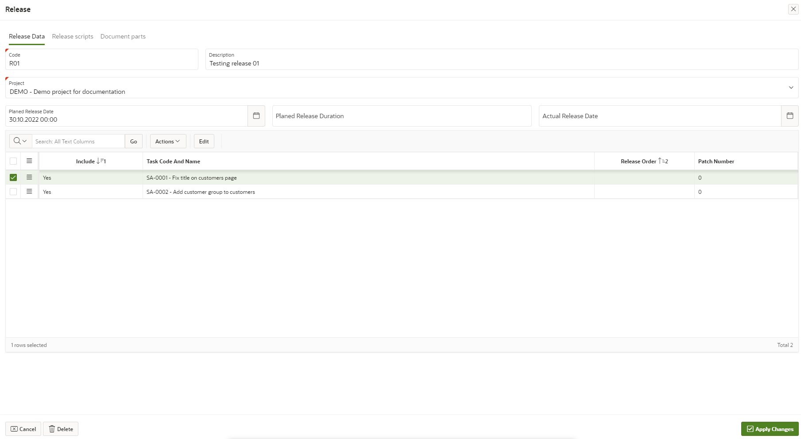
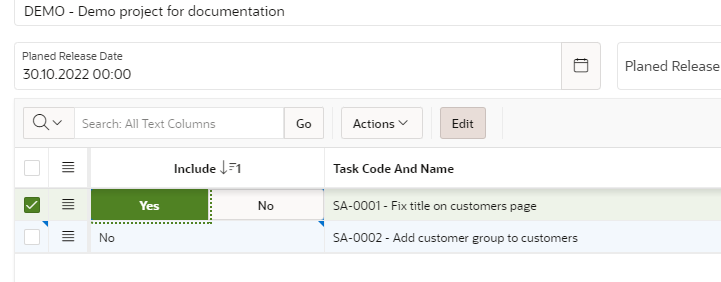
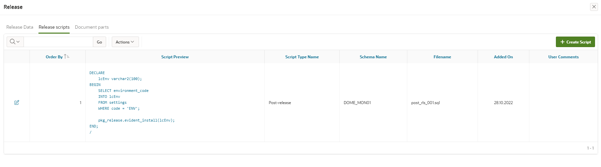
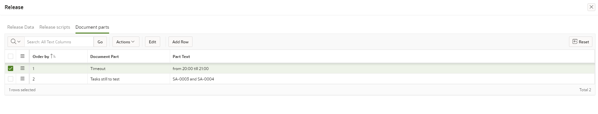

# Releases
In this module it is possible to:
- group single patches within a release
- prepare and download installation scripts for a complete release
- check dependencies for a release
- prepare release documentation
- get affected object list (objects in release)

To access: select menu option Releases

## Create new Release
New release can be created by clicking on button "Create" - a new release page opens:

Following data should be entered:
- release code and description
- a project (selected from DOME projects)
- planed release date, duration and actual release date (optionally)

## Edit existing Release
Existing release details page looks like this:

On existing release details page following actions can be conducted:
- edit overall release data (see Create new Release chapter)
- include patches in release
- add pre or post release scripts
- edit document parts text (for generating a documentation)

### Include Patches in Release
A list of patches, which are still not included in any release is displayed in lower part of the page.
User should mark patches within Include column to include them in release:

### Add pre or post Release Scripts
Accessible on Release scripts tab:

To work with release scripts is similar to working with patch scripts (see TODO).

Those scripts are added as pre-release or post-release scripts (at the beginning or end of installation).

### Edit Document Parts Text
Document parts are defined for a project (see TODO).
Texts are entered for every release and they are inserted instead of placeholders within generated documentation.
*Remark: Documentation templates are defined in project settings (see TODO).*

