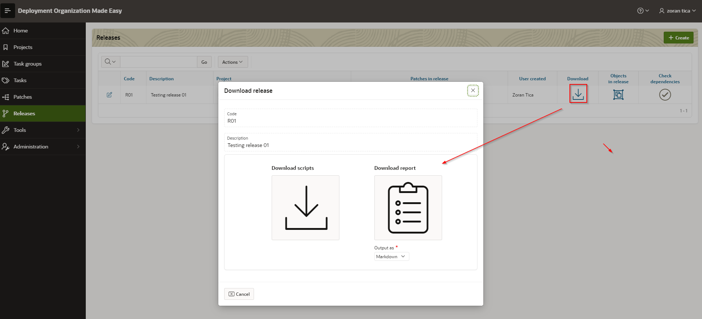
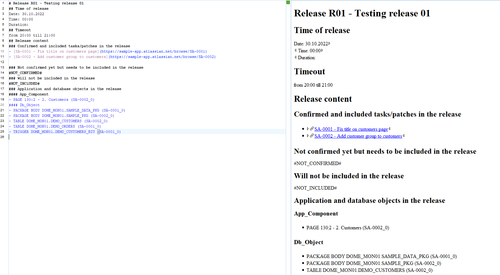

# Download Scripts and Documentation
To open a download page, a user should click on downoad icon within Download column (release region) for selected release.

## Download Scripts
Release scripts are packed up in a ZIP file and downloaded to user by clicking on large Download scripts button.

## Download Documentation
Documentation can be prepared and downloaded as Markdown document or HTML document.
To download a documentation, user should select output format and click on large Download Documentation button.
Downloaded document should look similar to this one:

