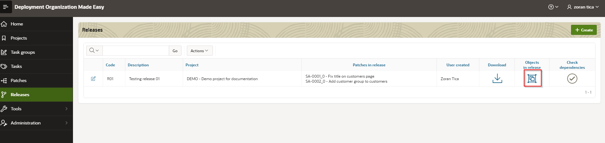
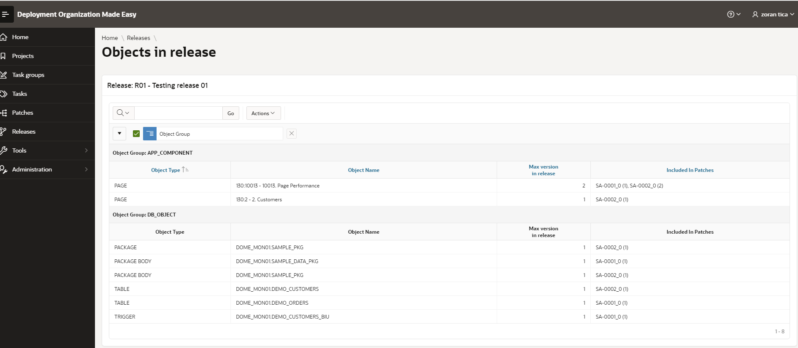

# Affected Objects List
To display a page with affected objects (objects included in release), user should click on grouping icon within Objects in release column on releases list page.

A page with objects list looks like:

