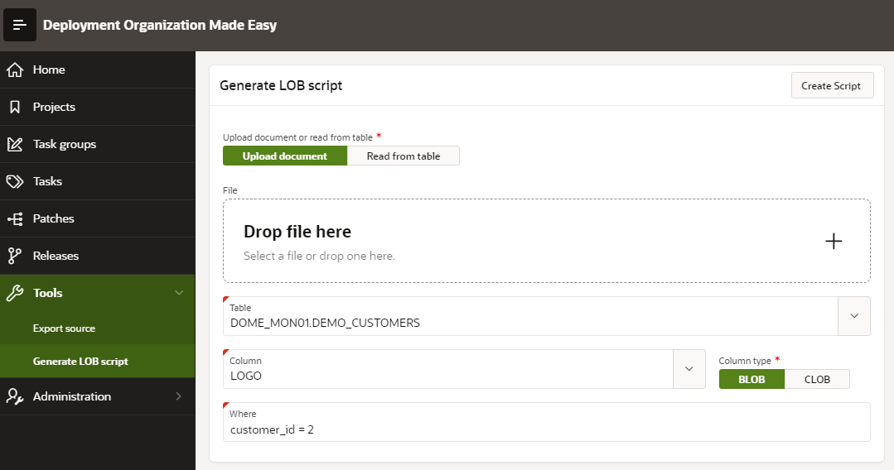

# Generate LOB Scripts
This tool is used to generate install scripts for LOB data (binary or large text files), which should be stored in database tables.
it is useful if some PDF files, images, word documents and similar files should be included within patch in order to be stored in target database.

## How to use it
To access: select menu option Tools -> Generate LOB script
A page opens:

First, a user should select if LOB data should be read from database table or from dropbox region on page.
After that, a target database table, column and condition should be selected.
Condition is important because it determines rows, which should be updated with LOB data (usually one record in database table).
At the end user should select LOB source type (binary or text - BLOB or CLOB) and click on Create Script button.

Installation script file is generated and downloaded to user, who can include it in desired patch as manual script.
The script is independent of anz other program logic and it can be executed standalone.
LOB data is converted in base64 format and included in PL/SQL block.
